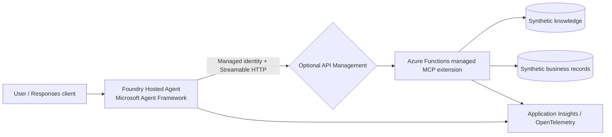

# Foundry Hosted Agent + Remote MCP Demo

This sample shows how an enterprise can expose governed knowledge, fictional
business data, and approval-gated capabilities to a Microsoft Foundry Hosted
Agent through the Azure Functions managed MCP extension. HWC implements tool
logic while Azure Functions owns the MCP endpoint, discovery, protocol
lifecycle, hosting, and scaling. Every record is synthetic. Nothing sends
email, calls a production system, or performs an irreversible action.

## Architecture



The production-shaped path uses Microsoft Agent Framework, the Responses 2.0
host, `gpt-5-mini`, and Azure Functions managed MCP tool triggers.

## Components

* **Hosted agent** (`agent/main.py`): Microsoft Agent Framework agent exposed
  through the Responses 2.0 protocol.
* **Local test double** (`agent/agent.py`, `agent/server.py`): fast scripted
  behavior for deterministic tests; it is not the deployed agent.
* **Managed remote MCP server** (`mcp-server/`): Azure Functions
  `mcpToolTrigger` functions. The Functions MCP extension owns Streamable HTTP,
  tool discovery, protocol lifecycle, and endpoint scaling.
* **Synthetic data** (`shared/data.py`): policy, architecture, operations,
  and HWC-1001 records.
* **Observability**: F5 exports agent spans to Foundry Toolkit on port 4317.
  Azure Functions supplies platform logs and Application Insights integration
  for the MCP runtime. The deployed hosted agent disables Agent Framework
  instrumentation so prompts, completions, tool arguments, and tool results are
  not written to session logs; HTTP status and Function platform telemetry remain
  available. No telemetry resource is provisioned by this repository's local
  workflow.

## Prerequisites

* Python 3.13
* Azure Functions Core Tools 4.0.7030 or later
* Azure Developer CLI with the Microsoft Foundry extension
* Access to a configured Microsoft Foundry project and `gpt-5-mini` deployment
* Microsoft Entra credentials available through `DefaultAzureCredential`

## Local setup and demo

```powershell
Set-Location C:\workspace\hosted-agent-mcp\foundry-hosted-agent-mcp-demo
Copy-Item agent\.env.example agent\.env
agent\.venv\Scripts\python.exe -m pip install -r agent\requirements.txt
agent\.venv\Scripts\python.exe -m pip install -r mcp-server\requirements.txt
```

Confirm the values in `agent/.env`, then press `F5` and select **Debug HWC
Hosted Agent**. VS Code starts the managed Functions MCP endpoint at
`http://127.0.0.1:8001/runtime/webhooks/mcp`, starts the Responses host on port
8088, attaches the debugger, and opens Foundry Toolkit Agent
Inspector and Trace Viewer. Use the first demo prompt, then select the agent
and MCP spans in Trace Viewer to show model, tool, latency, and correlation
metadata without exposing prompt or completion content.

For the scripted test-double harness instead:

```powershell
agent\.venv\Scripts\python.exe scripts\start_local.py
```

Exact demo prompts:

1. “Summarize the current position for fictional client HWC-1001. Identify the
   primary exception and show your sources.”
2. “Prepare a follow-up action for HWC-1001 addressing the primary exception.
   Do not execute it without approval.”

Flow A discovers tools, reads structured data and knowledge, and returns
source identifiers. Flow B prepares an action with `PENDING_APPROVAL`; no
execution endpoint exists until a human approval mechanism is added.
Reset state by restarting the MCP server.

## Tests

```powershell
agent\.venv\Scripts\python.exe -m unittest discover -s tests -v
```

Tests cover managed MCP trigger registration, validation, empty results,
missing entities, approval behavior, and deterministic demo
evaluations. See [evaluation.md](evaluation.md),
[docs/architecture.md](docs/architecture.md), and [docs/poc-plan.md](docs/poc-plan.md).

## Azure deployment (approval required)

Deployment is not part of local setup. Before any deployment, complete the
resource, identity, networking, observability, SKU, and cost sections in
`.azure/deployment-plan.md`; run Azure validation; review the resulting plan;
and obtain explicit approval. The managed MCP endpoint must be deployed and its
URL configured before deploying the hosted agent because a hosted agent cannot
reach `127.0.0.1`. The deployed path is `/runtime/webhooks/mcp`. The MCP
service's `prepackage` hook stages both the Function source and shared synthetic
data under `.azure/mcp-server`.

Cleanup: first list resources with `az resource list --resource-group
<resource-group> -o table`, confirm the list with the owner, then run
`azd down` only after explicit approval. This repository never deletes Azure
resources automatically.

## Security model and limitations

Microsoft Entra authentication must be enforced at the deployed Functions
ingress, with managed identity and least-privilege RBAC used between services.
The MCP extension webhook is anonymous because platform Easy Auth owns that
boundary; do not deploy it publicly without Easy Auth. Actions remain
proposal-only and use synthetic in-memory state.

## Troubleshooting

* `Connection refused`: run `func start --port 8001` from `mcp-server`.
* MCP initialization failure: verify Core Tools is 4.0.7030 or later and
  `MCP_SERVER_URL` ends with `/runtime/webhooks/mcp`.
* `The Azure Functions Python worker does not support windows-arm64`: run the
  managed MCP host on x64 Windows, WSL/Linux, or a supported container host.
* Remote `401`: verify Easy Auth configuration and the agent managed-identity
  token audience.
* Stale demo state: restart the MCP server.
