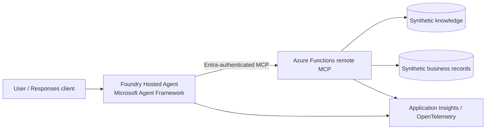

# Foundry Hosted Agent + Remote MCP Demo

This customer-demo-ready sample shows how an enterprise can expose governed
knowledge, fictional business data, and safe API capabilities to an AI agent.
Every record in this repository is synthetic. Nothing sends email, calls a
production system, or performs an irreversible action.

## Architecture



The `agent` package is a dependency-free local Responses-protocol harness.
In Azure, its tool-discovery and tool-call boundary maps directly to the
Microsoft Agent Framework hosted-agent pattern. The `mcp-server` package
provides streamable-HTTP-shaped JSON-RPC endpoints suitable for a Functions
HTTP trigger.

## Components

* **Hosted agent** (`agent/`): multi-turn-capable Responses endpoint, tool
  discovery, grounded sources, and approval-aware responses.
* **Remote MCP server** (`mcp-server/`): `tools/list`, `tools/call`, health
  check, input validation, correlation IDs, and optional bearer-token
  enforcement for local testing.
* **Synthetic data** (`shared/data.py`): policy, architecture, operations,
  and HWC-1001 records.
* **Observability**: set `APPLICATIONINSIGHTS_CONNECTION_STRING` when wiring
  the hosted deployment to OpenTelemetry/Application Insights. Correlation
  IDs are returned by MCP responses.

## Prerequisites

* Python 3.10+
* Azure Developer CLI (`azd`) for Azure deployment
* An Azure subscription and Microsoft Entra permissions (deployment is not
  performed by this sample)

## Local setup and demo

```bash
cd /home/runner/work/foundry-hosted-agent-mcp-demo/foundry-hosted-agent-mcp-demo
python -m venv .venv && . .venv/bin/activate
cp .env.example .env
python scripts/start_local.py
```

In another terminal:

```bash
curl http://127.0.0.1:8001/healthz
curl -X POST http://127.0.0.1:8001/mcp -H 'Content-Type: application/json' \
  -d '{"jsonrpc":"2.0","id":1,"method":"tools/list"}'
curl -X POST http://127.0.0.1:8000/v1/responses -H 'Content-Type: application/json' \
  -d '{"input":"Summarize the current position for fictional client HWC-1001. Identify the primary exception and show your sources."}'
```

Exact demo prompts:

1. “Summarize the current position for fictional client HWC-1001. Identify the
   primary exception and show your sources.”
2. “Prepare a follow-up action for HWC-1001 addressing the primary exception.
   Do not execute it without approval.”

Flow A discovers tools, reads structured data and knowledge, and returns
source identifiers. Flow B prepares an action with `PENDING_APPROVAL`; no
execution endpoint exists until a human approval mechanism is added.
Reset state with `python scripts/reset_demo.py` (or restart the local server).

## Tests

```bash
python -m unittest discover -s tests -v
# Optional: python -m pytest
```

Tests cover discovery, validation, empty results, missing entities,
approval-required behavior, agent integration, and health/error boundaries.

## Azure deployment (approval required)

Do not run deployment without reviewing the generated plan and approving the
resources. After configuring Entra identities and Foundry project settings:

```bash
azd auth login
azd init
azd provision       # review and approve the plan
azd deploy
```

Expected resources are an Azure Functions app (and its storage account),
Application Insights/Log Analytics, a Foundry project/hosted-agent resource,
and the required managed identity role assignments. Exact resource names and
SKU/cost depend on the subscription and `azd` environment. Configure Entra
authentication at the Functions ingress and use managed identity from the
agent; no credentials belong in source or `.env`.

Cleanup: first list resources with `az resource list --resource-group
<resource-group> -o table`, confirm the list with the owner, then run
`azd down` only after explicit approval. This repository never deletes Azure
resources automatically.

## Security model and limitations

Entra authentication should be enforced at the deployed ingress; locally,
set `MCP_AUTH_TOKEN` to require an `Authorization` header containing that
configured token. Errors return
safe messages and correlation IDs rather than credentials. Actions are
explicitly approval-gated and use synthetic in-memory state. The local
server is intentionally minimal and is not a production MCP gateway:
configure the official Azure Functions MCP/streamable HTTP adapter, network
restrictions, RBAC, secretless managed identity, and production telemetry
before deployment. The sample does not include a real LLM key or customer
data.

## Troubleshooting

* `Connection refused`: start `python scripts/start_local.py` and check both
  `/healthz` endpoints.
* `502` from the agent: ensure `MCP_SERVER_URL` points to port 8001.
* `401`: when `MCP_AUTH_TOKEN` is set, send an `Authorization` header with the
  configured token.
* Stale demo state: run `python scripts/reset_demo.py` or restart services.
