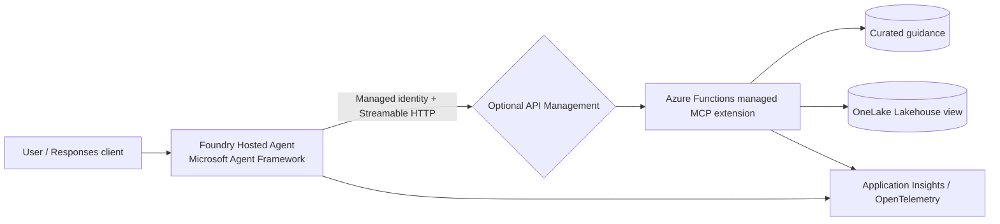

# Foundry Hosted Agent + Remote MCP Demo

This sample shows how an enterprise can expose governed knowledge, Lakehouse
business data, and approval-gated capabilities to a Microsoft Foundry Hosted
Agent through the Azure Functions managed MCP extension. HWC implements tool
logic while Azure Functions owns the MCP endpoint, discovery, protocol
lifecycle, hosting, and scaling. The business source is a curated summary view
in the configured enterprise Lakehouse. Nothing sends
email, calls a production system, or performs an irreversible action.

## Architecture


```mermaid
flowchart LR
  U[User / Responses client] --> A[Foundry Hosted Agent\nMicrosoft Agent Framework]
  A -->|Managed identity + Streamable HTTP| P{Optional API Management}
  P --> M[Azure Functions managed MCP extension]
  M --> K[(Curated guidance)]
  M --> B[(OneLake Lakehouse view)]
  A --> T[Application Insights / OpenTelemetry]
  M --> T
```

The production-shaped path uses Microsoft Agent Framework, the Responses 2.0
host, `gpt-5-mini`, and Azure Functions managed MCP tool triggers.

## Components

* **Hosted agent** (`agent/main.py`): Microsoft Agent Framework agent exposed
  through the Responses 2.0 protocol.
* **Local test double** (`agent/agent.py`, `agent/server.py`): fast scripted
  behavior for deterministic tests; it is not the deployed agent.
* **Managed remote MCP server** (`mcp-server/`): Azure Functions
  `mcpToolTrigger` functions. The Functions MCP extension owns Streamable HTTP,
  tool discovery, protocol lifecycle, and endpoint scaling.
* **Governed business data** (`shared/data.py`): the MCP business lookup can
  consume validated rows from the configured OneLake-backed summary view.
  Synthetic data remains the local fallback when `HWC_DATA_SOURCE=synthetic`.
* **Governed approvals** (`fabric/approval_notebook.py`): a parameterized
  Fabric notebook validates explicit decisions and appends them to the
  `action_approvals` Delta table with approver and UTC audit fields.
* **Observability**: F5 exports agent spans to Foundry Toolkit on port 4317.
  Azure Functions supplies platform logs and Application Insights integration
  for the MCP runtime. The deployed hosted agent disables Agent Framework
  instrumentation so prompts, completions, tool arguments, and tool results are
  not written to session logs; HTTP status and Function platform telemetry remain
  available. No telemetry resource is provisioned by this repository's local
  workflow.

## Prerequisites

* Python 3.13
* Azure Functions Core Tools 4.0.7030 or later
* Azure Developer CLI with the Microsoft Foundry extension
* Access to a configured Microsoft Foundry project and `gpt-5-mini` deployment
* Microsoft Entra credentials available through `DefaultAzureCredential`
* Microsoft ODBC Driver 18 for SQL Server when `HWC_DATA_SOURCE=fabric`
* x64 Windows or Linux when running the local Azure Functions Python worker;
  ARM64 hosts use the native MCP compatibility server described below

## Local setup and demo

```powershell
Set-Location C:\workspace\hosted-agent-mcp\foundry-hosted-agent-mcp-demo
Copy-Item agent\.env.example agent\.env
Copy-Item mcp-server\local.settings.json.example mcp-server\local.settings.json
agent\.venv\Scripts\python.exe -m pip install -r agent\requirements.txt
agent\.venv\Scripts\python.exe -m pip install -r mcp-server\requirements.txt
```

Confirm the values in `agent/.env` and `mcp-server/local.settings.json`, then press `F5` and select **Debug HWC
Hosted Agent**. VS Code starts the managed Functions MCP endpoint at
`http://127.0.0.1:8001/runtime/webhooks/mcp`, starts the Responses host on port
8088, attaches the debugger, and opens Foundry Toolkit Agent
Inspector and Trace Viewer. Use the first demo prompt, then select the agent
and MCP spans in Trace Viewer to show model, tool, latency, and correlation
metadata without exposing prompt or completion content.

For the scripted test-double harness instead:

```powershell
agent\.venv\Scripts\python.exe scripts\start_local.py
```

### ARM64 and Docker handoff

The current ARM64 Windows/WSL development path does **not** use Docker. The
Azure Functions MCP runtime image and its Python worker are x64. Running that
image on ARM64 through Docker's amd64/QEMU emulation caused the Python worker
to exit and left the MCP endpoint returning HTTP 503.

Use the native FastMCP compatibility server on ARM64. It exposes the same four
tools at the same Streamable HTTP URL and delegates to the same business logic
as the Azure Functions implementation. Azure Functions remains the production
deployment transport. Docker remains suitable on an x64 development host or
as part of an approved x64 deployment workflow.

From PowerShell on the ARM64 Windows host:

```powershell
$env:USE_LOCAL_MCP = "1"
agent\.venv\Scripts\python.exe scripts\start_local.py
```

The equivalent commands from WSL are:

```bash
export USE_LOCAL_MCP=1
./agent/.venv-wsl/bin/python scripts/start_local.py
```

The launcher loads the repository root `.env`. Keep `HWC_DATA_SOURCE=fabric`
and the Fabric SQL endpoint, database, schema, and summary-view coordinates in
that file to use the governed OneLake data. Set `HWC_DATA_SOURCE=synthetic`
only when an offline fallback is intentionally required.

On Windows, install the Fabric SQL driver from an elevated terminal if it is
not already available:

```powershell
winget install --id Microsoft.msodbcsql.18 --exact
```

### Demo script

Start with this briefing prompt:

> Summarize the current position for the demo entity HWC-1001. Identify the
> primary exception and show your sources.

Expected result: the agent calls `get_business_summary` and
`search_hwc_knowledge`, identifies the overdue reconciliation exception, and
returns source IDs `SYN-OPS-001` and `SYN-POL-001`.

Then use this proposal prompt:

> Prepare a follow-up action for the demo entity HWC-1001 addressing the
> primary exception. Do not execute it without approval.

Expected result: the agent calls `get_business_summary` and
`prepare_follow_up_action`, returns `PENDING_APPROVAL`, and reports that
explicit human approval is required. Enter the approver identity in the UI and
use **Approve** or **Reject** to record the decision through the Fabric
notebook. No generic field-update endpoint is exposed.

### Demo frontend

With the MCP server running on port 8001, start the customer-facing demo UI
from the repository root:

```powershell
$env:MCP_SERVER_URL = "http://127.0.0.1:8001/runtime/webhooks/mcp"
agent\.venv\Scripts\python.exe frontend\server.py
```

Open `http://127.0.0.1:5173`. The UI presents the exception briefing, source
identifiers, invoked MCP tools, and the proposal-only approval boundary. It
uses the deterministic Responses test double for presentation while all
business and knowledge retrieval still runs through the configured MCP
endpoint (native FastMCP on ARM64 or managed Azure Functions on x64).

Approval decisions use `FABRIC_APPROVAL_NOTEBOOK_ID`. The frontend submits an
explicit `APPROVED` or `REJECTED` decision, waits for the Fabric notebook job,
and displays its audit ID. The notebook verifies the exception exists before
appending to `action_approvals`; it never updates the SQL analytics endpoint.

## OneLake configuration

The governed business source uses these configured Fabric objects:

* Workspace: `<fabric-workspace-name>`
* Workspace ID: `<fabric-workspace-id>`
* Lakehouse: `<fabric-lakehouse-name>`
* Lakehouse ID: `<fabric-lakehouse-id>`
* Table: `dbo.<source-table-name>`
* Summary view: `dbo.<summary-view-name>`
* Approval notebook: `<fabric-approval-notebook-id>`

Provide the environment-specific coordinates in `.env` and
`mcp-server/local.settings.json` using the committed examples. Copy the latter
to `mcp-server/local.settings.json` before starting the Functions host. The
local file is ignored by Git because it is the place for runtime secrets and
local overrides.

The identity used to run the host needs read access to the Fabric Lakehouse and
permission to run the configured notebook. Provisioning or updating the
notebook requires Fabric workspace Contributor and `Notebook.ReadWrite.All` or
`Item.ReadWrite.All`. OneLake DFS access uses a Microsoft Entra token for
`https://storage.azure.com/`. A quick connectivity check lists the governed
schema at:

```text
https://onelake.dfs.fabric.microsoft.com/<workspace-id>/<lakehouse-id>/Tables/dbo
```

The expected entries are the configured source table and summary view. Read
access uses that source; approval writes are isolated in the append-only
`action_approvals` table and require an explicit approver identity.

## Tests

```powershell
agent\.venv\Scripts\python.exe -m unittest discover -s tests -v
```

Tests cover managed MCP trigger registration, validation, empty results,
missing entities, approval behavior, and deterministic demo
evaluations. See [evaluation.md](evaluation.md),
[docs/architecture.md](docs/architecture.md), and [docs/poc-plan.md](docs/poc-plan.md).

## Azure deployment (approval required)

Deployment is not part of local setup. Before any deployment, complete the
resource, identity, networking, observability, SKU, and cost sections in
`.azure/deployment-plan.md`; run Azure validation; review the resulting plan;
and obtain explicit approval. The managed MCP endpoint must be deployed and its
URL configured before deploying the hosted agent because a hosted agent cannot
reach `127.0.0.1`. The deployed path is `/runtime/webhooks/mcp`. The MCP
service's `prepackage` hook stages both the Function source and shared synthetic
data under `.azure/mcp-server`.

Cleanup: first list resources with `az resource list --resource-group
<resource-group> -o table`, confirm the list with the owner, then run
`azd down` only after explicit approval. This repository never deletes Azure
resources automatically.

### Deployment networking note

The project Storage Account may have `publicNetworkAccess: Disabled` because
of an effective organization policy. This is an operational deployment note,
not a limitation of the application. If package upload is unavailable from the
developer machine, use the approved private build path with access to the
Storage private endpoint, or the organization-approved policy exception route.
The Function App's managed identity and data-plane roles remain unchanged.

## Security model and limitations

Microsoft Entra authentication must be enforced at the deployed Functions
ingress, with managed identity and least-privilege RBAC used between services.
The MCP extension webhook is anonymous because platform Easy Auth owns that
boundary; do not deploy it publicly without Easy Auth. The sample approval UI
accepts an approver identifier for demonstration; production must derive that
identity from authenticated claims rather than trusting free-text input.

## Troubleshooting

* `Connection refused`: run `func start --port 8001` from `mcp-server`.
* MCP initialization failure: verify Core Tools is 4.0.7030 or later and
  `MCP_SERVER_URL` ends with `/runtime/webhooks/mcp`.
* `The Azure Functions Python worker does not support windows-arm64`: do not
  run the Functions host directly on Windows ARM64. Use an x64 Windows/Linux
  host or a supported x64 container host. On an ARM64 WSL distribution,
  installing Python 3.13 in a virtualenv is not enough: Core Tools still
  launches its bundled `linux-arm64` Python worker, which cannot load the
  MCP-capable Python 3.13 dependencies.
* `FunctionApp object has no attribute mcp_tool`: install the dependencies
  from `mcp-server/requirements.txt`. The managed MCP decorators require
  `azure-functions==2.3.0`, Python 3.13, and the current Azure Functions Core
  Tools runtime. Keep this version pinned; older 1.x releases do not provide
  the `mcp_tool` decorator.
* `Secret initialization from Blob storage failed`: for local development,
  set `AzureWebJobsSecretStorageType` to `Files` in
  `mcp-server/local.settings.json`. This avoids requiring Azurite or an Azure
  Storage connection just to start the local host.
* `No module named shared` when starting from `mcp-server`: include the repo
  root on `PYTHONPATH`:

  ```bash
  cd mcp-server
  PYTHONPATH=.. func start --port 8001
  ```

  On a Linux or WSL host, install dependencies once before starting:

  ```bash
  python3.13 -m venv .venv-wsl
  .venv-wsl/bin/python -m pip install -r mcp-server/requirements.txt
  ```

* Remote `401`: verify Easy Auth configuration and the agent managed-identity
  token audience.
* Stale demo state: restart the MCP server.
