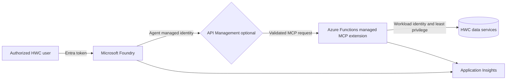

# HWC Architecture Discussion

## Operating Model

Microsoft Foundry owns the hosted agent runtime, model connection, scaling,
Responses endpoint, and agent lifecycle. The Azure Functions MCP extension
owns the Streamable HTTP endpoint, discovery, protocol lifecycle, hosting, and
scaling. HWC owns the agent instructions, tool logic, source-system
authorization, data classification, evaluations, and approval policy. Platform
teams retain control of network ingress, identity, API policy, telemetry
retention, and incident response.

## Trust Boundaries

1. **User to Foundry:** Microsoft Entra authenticates the caller. Foundry RBAC
   controls who can invoke, edit, evaluate, or administer the agent.
2. **Foundry to MCP:** The hosted agent uses a managed identity. Functions Easy
   Auth validates audience and issuer before the managed MCP webhook receives
   the request.
3. **MCP to data:** Each connector receives only the read or proposal permission
   required by its tool. The MCP service does not inherit broad user credentials.
4. **Action boundary:** Read tools may return governed records. Write-like tools
   create proposals only; a separate human approval and execution service is
   required before production actions exist.
5. **Telemetry boundary:** Operational metadata flows to Application Insights.
   Prompts, completions, tool arguments, and results remain disabled unless HWC
   approves their classification, redaction, access, and retention controls.

## API Management

API Management is optional for the pilot and useful when HWC needs a stable
enterprise endpoint, JWT and managed-identity policy, rate limits, quotas,
request-size controls, private ingress, version routing, or centralized audit.
It does not replace authorization inside a tool: the MCP server must still
enforce entity and operation-level access.

## OneLake Alignment

The MCP contract should remain stable while synthetic repositories are replaced
with governed adapters. A future OneLake adapter can query curated shortcuts,
lakehouses, or warehouse views using workload identity and existing Fabric
permissions. Return source identifiers and freshness metadata, avoid exposing
raw zones directly, and apply row/column security in the serving layer rather
than relying on agent instructions. SharePoint or business APIs remain separate
adapters behind the same policy and telemetry boundary.

## Production Decisions

- Public versus private MCP ingress and DNS resolution from Foundry
- Managed identities, token audiences, and exact RBAC assignments
- APIM requirement, tier, policies, and ownership
- Data classification, residency, retention, and telemetry sampling
- OneLake/Fabric capacity, serving endpoint, and security model
- Availability target, regional strategy, quotas, budget, and support ownership